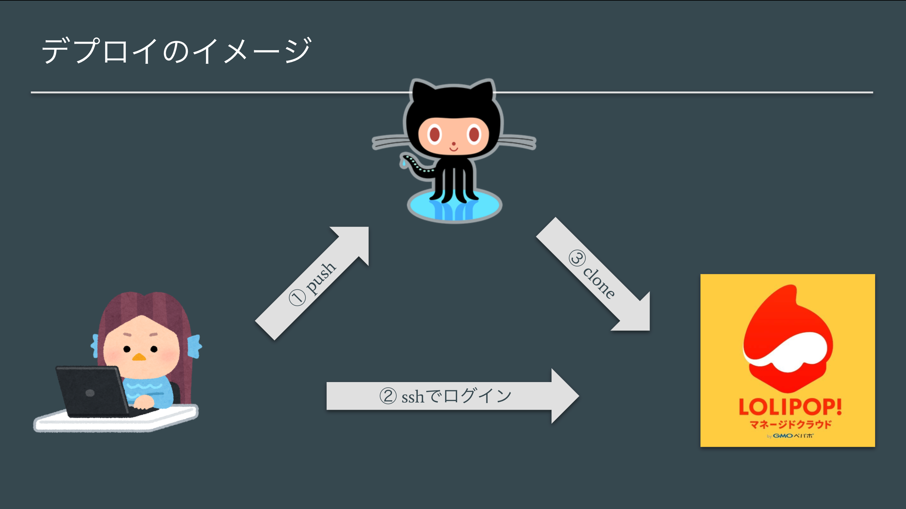

# デプロイの概要

## デプロイ概略図

実装したプロジェクトをGitHubにpushし，デプロイ先のサーバ（マネージドクラウド）にログインして GitHub上のプロジェクトをclone(or pull)することでデプロイを実現する．

### 💡 Key Point

>下記パターンの操作環境があるので，都度正しい操作環境で操作しているかどうかを確認すること．
>
>- ブラウザ
>- ローカルPCのターミナル
>- マネージドクラウド

## マネクラでプロジェクトを作成する．

>ブラウザでの操作

マネクラに登録してプロジェクトを作成しておく．PHPを選択し，プロジェクト名は任意に設定．

登録したらプロジェクトページを開いておくと良い．
