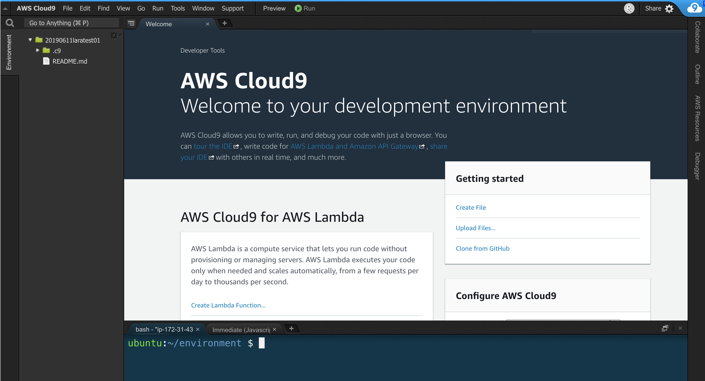

# Environment（仮想マシン）準備

## environmentの準備

- environmentとはアプリケーションを動作させる環境．AWS上に仮想マシンが立ち上がる．
- 1つのwebアプリケーションに対して，1つのenvironmentいう理解でOK．

まず，AWSのマネジメントコンソールから「cloud9」を探してアクセスする．

下記の画面になるので「create environment」をクリック．

名前を適当に入力．（Descriptionは任意）

【重要】「Platform」は「`ubuntu server 18.04 LTS`」を選択．「Instance type」は「`t2.micro`」を選択．その他はデフォルトで「create environment」をクリック．

確認画面が出るので「next step」をクリック．

しばらく待つと下記の画面が表示される．これで準備完了．

