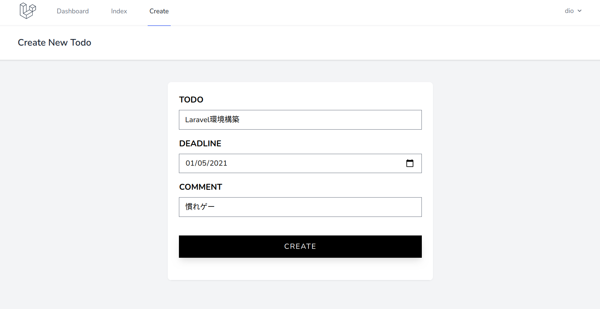

# データ一覧画面の実装

## データ参照処理の作成

締切が早い順にソートしてデータを参照する処理を作成する．

### Modelの処理

まず，上記の条件でデータを取得する関数を Modelに作成する．

`laravel_todo/app/Models/Todo.php`に以下の関数を作成する．

```php
public static function getAllOrderByDeadline()
{
  return self::orderBy('deadline', 'asc')->get();
}
```

> 【解説】
>
> - `self`は Todoモデルのこと．
> - `orderBy()`はSQLのものと同じ理解でOK．
> - 最後の`get()`がないと実行されないので注意．

### Controllerを編集

`/laravel_todo/app/Http/Controllers/TodoController.php`の`index()`を内容を以下のように編集する．

```php
public function index()
{
  // モデルに定義した関数を実行する．
  $todos = Todo::getAllOrderByDeadline();
  return view('todo.index', [
    'todos' => $todos
  ]);
}
```

todo作成画面でデータを入力して送信すると，自動的に一覧画面に切り替わる．



自分が入力したデータが表示されていればOK．何件かデータを入れておこう．


