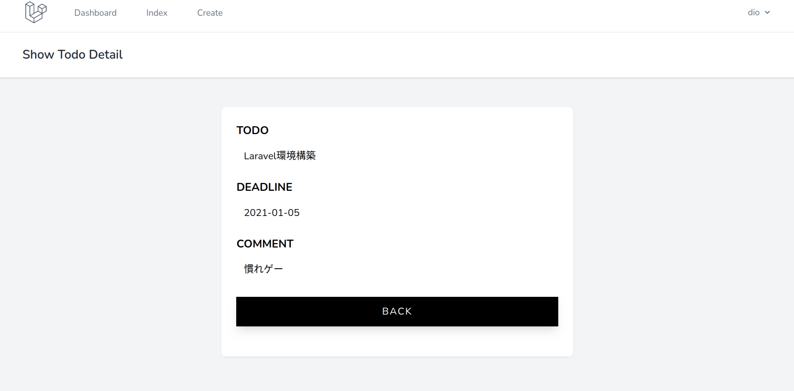

# データ詳細画面の実装

詳細画面はtodoの1件を個別に表示する．

## 一覧画面に詳細画面へのリンクを作成

各todoの詳細を取得する処理と表示する画面を作成する．

一覧画面のtodo名をクリックすると詳細画面に移動するようにする．

クリックするとコントローラの`show()`関数にリクエストを送るように記述している．

`index.blade.php`を以下のように編集する．

```php
<x-app-layout>
  <x-slot name="header">
    <h2 class="font-semibold text-xl text-gray-800 leading-tight">
      {{ __('Todo Index') }}
    </h2>
  </x-slot>

  <div class="py-12">
    <div class="max-w-7xl mx-auto sm:w-10/12 md:w-8/10 lg:w-8/12">
      <div class="bg-white overflow-hidden shadow-sm sm:rounded-lg">
        <div class="p-6 bg-white border-b border-gray-200">
          <table class="text-center w-full border-collapse">
            <thead>
              <tr>
                <th class="py-4 px-6 bg-grey-lightest font-bold uppercase text-lg text-grey-dark border-b border-grey-light">todo</th>
                <th class="py-4 px-6 bg-grey-lightest font-bold uppercase text-lg text-grey-dark border-b border-grey-light">deadline</th>
                <th class="py-4 px-6 bg-grey-lightest font-bold uppercase text-lg text-grey-dark border-b border-grey-light">actions</th>
              </tr>
            </thead>
            <tbody>
              @foreach ($todos as $todo)
              <tr class="hover:bg-grey-lighter">
                <td class="py-4 px-6 border-b border-grey-light">
                  <!-- ↓ここがリンクになるように編集する -->
                  <a href="{{ route('todo.show',$todo->id) }}">{{$todo->todo}}</a>
                </td>
                <td class="py-4 px-6 border-b border-grey-light">{{$todo->deadline}}</td>
                <td class="py-4 px-6 border-b border-grey-light flex justify-center">
                  <!-- 更新ボタン -->
                  <!-- 削除ボタン -->
                </td>
              </tr>
              @endforeach
            </tbody>
          </table>
        </div>
      </div>
    </div>
  </div>
</x-app-layout>
```

## 指定した1件のデータを取得する処理を追加

`show()`関数では，IDを指定して1件のデータを取得したい．

`/laravel_todo/app/Http/Controllers/TodoController.php`の`show()`を内容を以下のように編集する．

```php
public function show($id)
{
  $todo = Todo::find($id);
  return view('todo.show', ['todo' => $todo]);
}
```

ここでは，受け取ったIDの値でテーブルからデータを取り出し，`todo`という名前で`show.blade.php`に渡している．

## 詳細表示画面の作成

詳細画面の`show.blade.php`を以下のように編集する．

```php
<x-app-layout>
  <x-slot name="header">
    <h2 class="font-semibold text-xl text-gray-800 leading-tight">
      {{ __('Show Todo Detail') }}
    </h2>
  </x-slot>

  <div class="py-12">
    <div class="max-w-7xl mx-auto sm:w-8/12 md:w-1/2 lg:w-5/12">
      <div class="bg-white overflow-hidden shadow-sm sm:rounded-lg">
        <div class="p-6 bg-white border-b border-gray-200">
          <div class="mb-6">
            <div class="flex flex-col mb-4">
              <p class="mb-2 uppercase font-bold text-lg text-grey-darkest">Todo</p>
              <p class="py-2 px-3 text-grey-darkest" id="todo">
                {{$todo->todo}}
              </p>
            </div>
            <div class="flex flex-col mb-4">
              <p class="mb-2 uppercase font-bold text-lg text-grey-darkest">Deadline</p>
              <p class="py-2 px-3 text-grey-darkest" id="deadline">
                {{$todo->deadline}}
              </p>
            </div>
            <div class="flex flex-col mb-4">
              <p class="mb-2 uppercase font-bold text-lg text-grey-darkest">Comment</p>
              <p class="py-2 px-3 text-grey-darkest" id="comment">
                {{$todo->comment}}
              </p>
            </div>
            <a href="{{ route('todo.index') }}" class="block text-center w-full py-3 mt-6 font-medium tracking-widest text-white uppercase bg-black shadow-lg focus:outline-none hover:bg-gray-900 hover:shadow-none">
              Back
            </a>
          </div>
        </div>
      </div>
    </div>
  </div>
</x-app-layout>
```

一覧画面で各todoをクリックし，下記のように詳細画面が表示されればOK．



