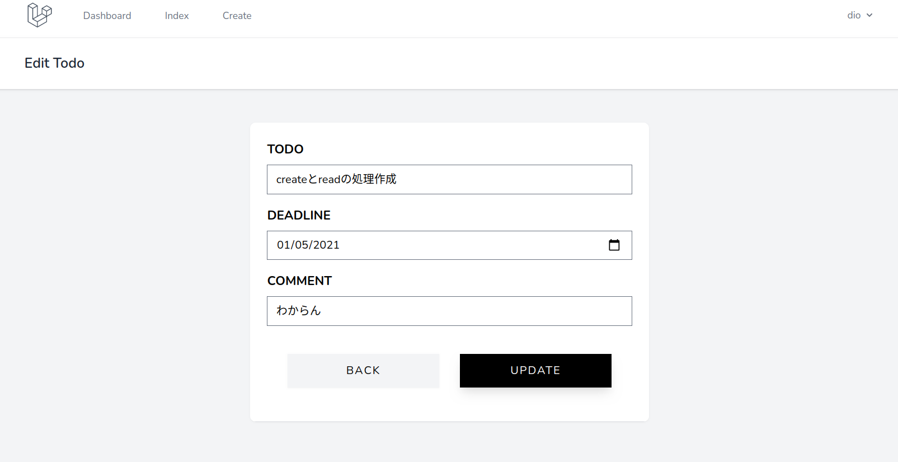
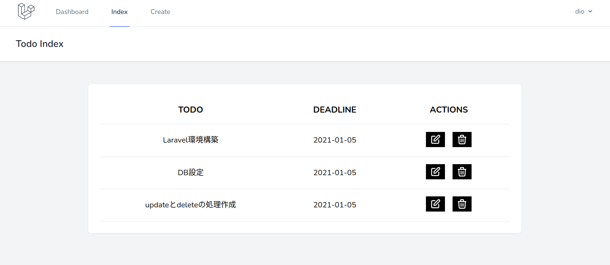

# データ更新処理の実装

更新処理は

1. 一覧画面に編集ボタンを設置．
2. 編集ボタンをクリックしたら編集画面に移動.
3. 編集画面でデータを書き換え，送信ボタンクリックでDBのデータを更新する．

## 一覧画面に編集ボタンを追加

`index.blade.php`を以下のように編集する．

```php
<x-app-layout>
  <x-slot name="header">
    <h2 class="font-semibold text-xl text-gray-800 leading-tight">
      {{ __('Todo Index') }}
    </h2>
  </x-slot>

  <div class="py-12">
    <div class="max-w-7xl mx-auto sm:w-10/12 md:w-8/10 lg:w-8/12">
      <div class="bg-white overflow-hidden shadow-sm sm:rounded-lg">
        <div class="p-6 bg-white border-b border-gray-200">
          <table class="text-center w-full border-collapse">
            <thead>
              <tr>
                <th class="py-4 px-6 bg-grey-lightest font-bold uppercase text-lg text-grey-dark border-b border-grey-light">todo</th>
                <th class="py-4 px-6 bg-grey-lightest font-bold uppercase text-lg text-grey-dark border-b border-grey-light">deadline</th>
                <th class="py-4 px-6 bg-grey-lightest font-bold uppercase text-lg text-grey-dark border-b border-grey-light">actions</th>
              </tr>
            </thead>
            <tbody>
              @foreach ($todos as $todo)
              <tr class="hover:bg-grey-lighter">
                <td class="py-4 px-6 border-b border-grey-light">
                  <a href="{{ route('todo.show',$todo->id) }}">{{$todo->todo}}</a>
                </td>
                <td class="py-4 px-6 border-b border-grey-light">{{$todo->deadline}}</td>
                <td class="py-4 px-6 border-b border-grey-light flex justify-center">
                  <!-- 更新ボタン -->
                  <form action="{{ route('todo.edit',$todo->id) }}" method="GET">
                    @csrf
                    <button type="submit" class="mr-2 ml-2 text-sm bg-black hover:bg-gray-900 hover:shadow-none text-white py-1 px-2 focus:outline-none focus:shadow-outline">
                      <svg class="h-6 w-6 text-gray-500" fill="none" viewBox="0 0 24 24" stroke="white">
                        <path stroke-linecap="round" stroke-linejoin="round" stroke-width="2" d="M11 5H6a2 2 0 00-2 2v11a2 2 0 002 2h11a2 2 0 002-2v-5m-1.414-9.414a2 2 0 112.828 2.828L11.828 15H9v-2.828l8.586-8.586z" />
                      </svg>
                    </button>
                  </form>
                  <!-- 削除ボタン -->
                  <form action="{{ route('todo.destroy',$todo->id) }}" method="POST">
                    @method('delete')
                    @csrf
                    <button type="submit" class="mr-2 ml-2 text-sm bg-black hover:bg-gray-900 hover:shadow-none text-white py-1 px-2 focus:outline-none focus:shadow-outline">
                      <svg class="h-6 w-6 text-gray-500" fill="none" viewBox="0 0 24 24" stroke="white">
                        <path stroke-linecap="round" stroke-linejoin="round" stroke-width="2" d="M19 7l-.867 12.142A2 2 0 0116.138 21H7.862a2 2 0 01-1.995-1.858L5 7m5 4v6m4-6v6m1-10V4a1 1 0 00-1-1h-4a1 1 0 00-1 1v3M4 7h16" />
                      </svg>
                    </button>
                  </form>
                </td>
              </tr>
              @endforeach
            </tbody>
          </table>
        </div>
      </div>
    </div>
  </div>
</x-app-layout>
```

一覧画面に編集ボタンが表示されていればOK．


## 更新画面に移動する処理の作成

`/laravel_todo/app/Http/Controllers/TodoController.php`の`edit()`を内容を以下のように編集する．

```php
public function edit($id)
{
  $todo = Todo::find($id);
  return view('todo.edit', ['todo' => $todo]);
}
```

やっていることは`create()`関数と同様．

## 更新画面の作成

`edit.blade.php`を以下のように編集する．

```php
<x-app-layout>
  <x-slot name="header">
    <h2 class="font-semibold text-xl text-gray-800 leading-tight">
      {{ __('Edit Todo') }}
    </h2>
  </x-slot>

  <div class="py-12">
    <div class="max-w-7xl mx-auto sm:w-8/12 md:w-1/2 lg:w-5/12">
      <div class="bg-white overflow-hidden shadow-sm sm:rounded-lg">
        <div class="p-6 bg-white border-b border-gray-200">
          @include('common.errors')
          <form class="mb-6" action="{{ route('todo.update',$todo->id) }}" method="POST">
            @method('put')
            @csrf
            <div class="flex flex-col mb-4">
              <label class="mb-2 uppercase font-bold text-lg text-grey-darkest" for="todo">Todo</label>
              <input class="border py-2 px-3 text-grey-darkest" type="text" name="todo" id="todo" value="{{$todo->todo}}">
            </div>
            <div class="flex flex-col mb-4">
              <label class="mb-2 uppercase font-bold text-lg text-grey-darkest" for="deadline">Deadline</label>
              <input class="border py-2 px-3 text-grey-darkest" type="date" name="deadline" id="deadline" value="{{$todo->deadline}}">
            </div>
            <div class="flex flex-col mb-4">
              <label class="mb-2 uppercase font-bold text-lg text-grey-darkest" for="comment">Comment</label>
              <input class="border py-2 px-3 text-grey-darkest" type="text" name="comment" id="comment" value="{{$todo->comment}}">
            </div>
            <div class="flex justify-evenly">
              <a href="{{ route('todo.index') }}" class="block text-center w-5/12 py-3 mt-6 font-medium tracking-widest text-black uppercase bg-gray-100 shadow-sm focus:outline-none hover:bg-gray-200 hover:shadow-none">
                Back
              </a>
              <button type="submit" class="w-5/12 py-3 mt-6 font-medium tracking-widest text-white uppercase bg-black shadow-lg focus:outline-none hover:bg-gray-900 hover:shadow-none">
                Update
              </button>
            </div>
          </form>
        </div>
      </div>
    </div>
  </div>
</x-app-layout>
```

一覧画面の更新ボタンをクリックし，現在のデータが表示されていればOK．



## 指定したデータを更新する処理の作成

編集画面でデータを書き換え，コントローラの`update()`関数にデータを送信し，DBのデータを更新する．

`/laravel_todo/app/Http/Controllers/TodoController.php`の`update()`を内容を以下のように編集する．

```php
public function update(Request $request, $id)
{
  //バリデーション
  $validator = Validator::make($request->all(), [
    'todo' => 'required | max:191',
    'deadline' => 'required',
  ]);
  //バリデーション:エラー
  if ($validator->fails()) {
    return redirect()
      ->route('todo.edit', $id)
      ->withInput()
      ->withErrors($validator);
  }
  //データ更新処理
  // updateは更新する情報がなくても更新が走る（updated_atが更新される）
  $result = Todo::find($id)->update($request->all());
  // fill()save()は更新する情報がない場合は更新が走らない（updated_atが更新されない）
  // $redult = Todo::find($id)->fill($request->all())->save();
  return redirect()->route('todo.index');
}
```

編集画面で書き換えたデータに更新されればOK．



