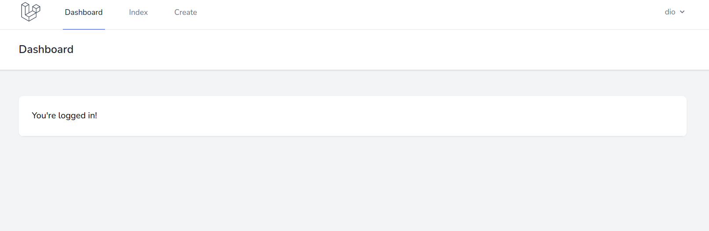

# 必要な画面の作成

## 共通画面の作成

実際にブラウザ画面に表示される内容を記述する．ビューファイルは`*.blade.php`の形式で作成する．これは「bladeテンプレート」と呼ばれる形式であり，コントローラとのデータのやり取りなどに最適化されている．

**ビューファイルは`latavel_todo/resources/views`ディレクトリ以下に配置する．**

bladeテンプレートでは共通パーツと個別パーツを組み合わせて画面を構成する．例えば，アプリケーション全体を通して表示されるナビゲーションバーやエラー画面などは共通パーツである．

それぞれのパーツは「コンポーネント」と呼ばれる．


## 共通パーツ（エラー表示）の作成

入力値が不正な場合などはエラー画面を表示して対応する．

todoの入力や編集など複数の画面で必要となるため，共通のコンポーネントとして作成する．

`latavel_todo/resources/views`の中に`common`フォルダを作成する．
`common`フォルダの中に`errors.blade.php`ファイルを作成する．

`errors.blade.php`に以下の内容を記述する．

```php
@if (count($errors) > 0)
<div>
  <div class="font-medium text-red-600">
    {{ __('Whoops! Something went wrong.') }}
  </div>

  <ul class="mt-3 list-disc list-inside text-sm text-red-600">
    @foreach ($errors->all() as $error)
    <li>{{ $error }}</li>
    @endforeach
  </ul>
</div>
@endif

```

## 共通パーツ（ナビゲーションバー）の調整

ナビゲーションバーもアプリケーションを通じて使用するため，共通パーツとして作成する．

「todo一覧」と「todo作成」の 2 種類のリンクを作成しておく．

`laravel_todo/resources/views/layouts/navigation.blade.php`の内容を以下のように編集する．

全部で4箇所追記があるので注意．

```php
<nav x-data="{ open: false }" class="bg-white border-b border-gray-100">
  <!-- Primary Navigation Menu -->
  <div class="max-w-7xl mx-auto px-4 sm:px-6 lg:px-8">
    <div class="flex justify-between h-16">
      <div class="flex">
        <!-- Logo -->
        <div class="flex-shrink-0 flex items-center">
          <a href="{{ route('dashboard') }}">
            <x-application-logo class="block h-10 w-auto fill-current text-gray-600" />
          </a>
        </div>

        <!-- Navigation Links -->
        <div class="hidden space-x-8 sm:-my-px sm:ml-10 sm:flex">
          <x-nav-link :href="route('dashboard')" :active="request()->routeIs('dashboard')">
            {{ __('Dashboard') }}
          </x-nav-link>
        </div>
        <!-- ↓一覧ページへのリンクを追加 -->
        <div class="hidden space-x-8 sm:-my-px sm:ml-10 sm:flex">
          <x-nav-link :href="route('todo.index')" :active="request()->routeIs('todo.index')">
            {{ __('Index') }}
          </x-nav-link>
        </div>
        <!-- ↓作成ページへのリンクを追加 -->
        <div class="hidden space-x-8 sm:-my-px sm:ml-10 sm:flex">
          <x-nav-link :href="route('todo.create')" :active="request()->routeIs('todo.create')">
            {{ __('Create') }}
          </x-nav-link>
        </div>
      </div>

      <!-- Settings Dropdown -->
      <div class="hidden sm:flex sm:items-center sm:ml-6">
        <x-dropdown align="right" width="48">
          <x-slot name="trigger">
            <button class="flex items-center text-sm font-medium text-gray-500 hover:text-gray-700 hover:border-gray-300 focus:outline-none focus:text-gray-700 focus:border-gray-300 transition duration-150 ease-in-out">
              <div>{{ Auth::user()->name }}</div>

              <div class="ml-1">
                <svg class="fill-current h-4 w-4" xmlns="http://www.w3.org/2000/svg" viewBox="0 0 20 20">
                  <path fill-rule="evenodd" d="M5.293 7.293a1 1 0 011.414 0L10 10.586l3.293-3.293a1 1 0 111.414 1.414l-4 4a1 1 0 01-1.414 0l-4-4a1 1 0 010-1.414z" clip-rule="evenodd" />
                </svg>
              </div>
            </button>
          </x-slot>

          <x-slot name="content">
            <!-- Authentication -->
            <form method="POST" action="{{ route('logout') }}">
              @csrf

              <x-dropdown-link :href="route('logout')" onclick="event.preventDefault();
                                                this.closest('form').submit();">
                {{ __('Logout') }}
              </x-dropdown-link>
            </form>
          </x-slot>
        </x-dropdown>
      </div>

      <!-- Hamburger -->
      <div class="-mr-2 flex items-center sm:hidden">
        <button @click="open = ! open" class="inline-flex items-center justify-center p-2 rounded-md text-gray-400 hover:text-gray-500 hover:bg-gray-100 focus:outline-none focus:bg-gray-100 focus:text-gray-500 transition duration-150 ease-in-out">
          <svg class="h-6 w-6" stroke="currentColor" fill="none" viewBox="0 0 24 24">
            <path :class="{'hidden': open, 'inline-flex': ! open }" class="inline-flex" stroke-linecap="round" stroke-linejoin="round" stroke-width="2" d="M4 6h16M4 12h16M4 18h16" />
            <path :class="{'hidden': ! open, 'inline-flex': open }" class="hidden" stroke-linecap="round" stroke-linejoin="round" stroke-width="2" d="M6 18L18 6M6 6l12 12" />
          </svg>
        </button>
      </div>
    </div>
  </div>

  <!-- Responsive Navigation Menu -->
  <div :class="{'block': open, 'hidden': ! open}" class="hidden sm:hidden">
    <div class="pt-2 pb-3 space-y-1">
      <x-responsive-nav-link :href="route('dashboard')" :active="request()->routeIs('dashboard')">
        {{ __('Dashboard') }}
      </x-responsive-nav-link>
    </div>
    <!-- ↓一覧ページへのリンクを追加 -->
    <div class="pt-2 pb-3 space-y-1">
      <x-responsive-nav-link :href="route('todo.index')" :active="request()->routeIs('todo.index')">
        {{ __('Index') }}
      </x-responsive-nav-link>
    </div>
    <!-- ↓作成ページへのリンクを追加 -->
    <div class="pt-2 pb-3 space-y-1">
      <x-responsive-nav-link :href="route('todo.create')" :active="request()->routeIs('todo.create')">
        {{ __('Create') }}
      </x-responsive-nav-link>
    </div>

    <!-- Responsive Settings Options -->
    <div class="pt-4 pb-1 border-t border-gray-200">
      <div class="flex items-center px-4">
        <div class="flex-shrink-0">
          <svg class="h-10 w-10 fill-current text-gray-400" xmlns="http://www.w3.org/2000/svg" fill="none" viewBox="0 0 24 24" stroke="currentColor">
            <path stroke-linecap="round" stroke-linejoin="round" stroke-width="2" d="M16 7a4 4 0 11-8 0 4 4 0 018 0zM12 14a7 7 0 00-7 7h14a7 7 0 00-7-7z" />
          </svg>
        </div>

        <div class="ml-3">
          <div class="font-medium text-base text-gray-800">{{ Auth::user()->name }}</div>
          <div class="font-medium text-sm text-gray-500">{{ Auth::user()->email }}</div>
        </div>
      </div>

      <div class="mt-3 space-y-1">
        <!-- Authentication -->
        <form method="POST" action="{{ route('logout') }}">
          @csrf

          <x-responsive-nav-link :href="route('logout')" onclick="event.preventDefault();
                                        this.closest('form').submit();">
            {{ __('Logout') }}
          </x-responsive-nav-link>
        </form>
      </div>
    </div>
  </div>
</nav>

```

> 【解説】
>
> - Laravel8のビューは CSS フレームワークの`tailwind.css`を使用している．
> - 予め用意されたクラス名を記述するだけでスタイルを適用できるので，ドキュメントを読みながらスタイルを変更してみよう．

画面をリロードすると下記のようにナビゲーションが設置された状態となる（一覧ページと作成ページはまだ作成していないので動作しない点に注意）．




## todo作成画面の作成

まず，`latavel_todo/resources/views`の中に`todo`フォルダを作成する．

続いて，`todo`フォルダの中に以下のファイルを作成する．今後必要になる画面のファイルも合わせて作成している．

- `index.blade.php`（todo一覧画面）
- `create.blade.php`（todo作成画面）
- `show.blade.php`（todo詳細画面）
- `edit.blade.php`（todo編集画面）

ファイルを作成したら`create.blade.php`を以下のように編集する．

```php
<x-app-layout>
  <x-slot name="header">
    <h2 class="font-semibold text-xl text-gray-800 leading-tight">
      {{ __('Create New Todo') }}
    </h2>
  </x-slot>

  <div class="py-12">
    <div class="max-w-7xl mx-auto sm:w-8/12 md:w-1/2 lg:w-5/12">
      <div class="bg-white overflow-hidden shadow-sm sm:rounded-lg">
        <div class="p-6 bg-white border-b border-gray-200">
          @include('common.errors')
          <form class="mb-6" action="{{ route('todo.store') }}" method="POST">
            @csrf
            <div class="flex flex-col mb-4">
              <label class="mb-2 uppercase font-bold text-lg text-grey-darkest" for="todo">Todo</label>
              <input class="border py-2 px-3 text-grey-darkest" type="text" name="todo" id="todo">
            </div>
            <div class="flex flex-col mb-4">
              <label class="mb-2 uppercase font-bold text-lg text-grey-darkest" for="deadline">Deadline</label>
              <input class="border py-2 px-3 text-grey-darkest" type="date" name="deadline" id="deadline">
            </div>
            <div class="flex flex-col mb-4">
              <label class="mb-2 uppercase font-bold text-lg text-grey-darkest" for="comment">Comment</label>
              <input class="border py-2 px-3 text-grey-darkest" type="text" name="comment" id="comment">
            </div>
            <button type="submit" class="w-full py-3 mt-6 font-medium tracking-widest text-white uppercase bg-black shadow-lg focus:outline-none hover:bg-gray-900 hover:shadow-none">
              Create
            </button>
          </form>
        </div>
      </div>
    </div>
  </div>
</x-app-layout>

```

> 【解説】
>
> - `route('todo.store')`は`TodoController`の`store()`関数にデータを送ることを示している．
> - `@csrf`はセキュリティ対策．フォームからデータを送信するときには必ず記述すること．

編集したらブラウザから`localhost/todo/create`にアクセスして動作確認．
下記画面になっていればOK．


## todo一覧画面の作成

続いて，`index.blade.php`を以下のように編集する．

```php
<x-app-layout>
  <x-slot name="header">
    <h2 class="font-semibold text-xl text-gray-800 leading-tight">
      {{ __('Todo Index') }}
    </h2>
  </x-slot>

  <div class="py-12">
    <div class="max-w-7xl mx-auto sm:w-10/12 md:w-8/10 lg:w-8/12">
      <div class="bg-white overflow-hidden shadow-sm sm:rounded-lg">
        <div class="p-6 bg-white border-b border-gray-200">
          <table class="text-center w-full border-collapse">
            <thead>
              <tr>
                <th class="py-4 px-6 bg-grey-lightest font-bold uppercase text-lg text-grey-dark border-b border-grey-light">todo</th>
                <th class="py-4 px-6 bg-grey-lightest font-bold uppercase text-lg text-grey-dark border-b border-grey-light">deadline</th>
                <th class="py-4 px-6 bg-grey-lightest font-bold uppercase text-lg text-grey-dark border-b border-grey-light">actions</th>
              </tr>
            </thead>
            <tbody>
              @foreach ($todos as $todo)
              <tr class="hover:bg-grey-lighter">
                <td class="py-4 px-6 border-b border-grey-light">
                  <p>{{$todo->todo}}</p>
                </td>
                <td class="py-4 px-6 border-b border-grey-light">{{$todo->deadline}}</td>
                <td class="py-4 px-6 border-b border-grey-light flex justify-center">
                  <!-- 更新ボタン -->
                  <!-- 削除ボタン -->
                </td>
              </tr>
              @endforeach
            </tbody>
          </table>
        </div>
      </div>
    </div>
  </div>
</x-app-layout>

```

こちらはエラーが発生する．


コントローラから`$todos`という名前でデータを受け取るよう記述しているが，コントローラからデータが送られていないためである．

とりあえず空のデータを送るように`/laravel_todo/app/Http/Controllers/TodoController.php`の`index()`を内容を以下のように編集する．

> 【解説】
>
> - `view()`関数の第 2 引数に渡したいデータを配列で記述する．
> - ここでは「`todos`」という名前で「空の配列」を送っている．
> - ビューファイル側では`$todos`とすることで渡されたデータを使うことができる．
> - また，変数などのデータは`var_dump()`または`dd()`または`ddd()`で確認することができる．これらを使ってデータの構造を確認しながら進めると良いだろう．

```php
public function index()
{
  return view('todo.index', [
    'todos' => []
  ]);
}

```

編集したらブラウザから`localhost/todo`にアクセスして動作確認．
下記画面になっていれば OK．


